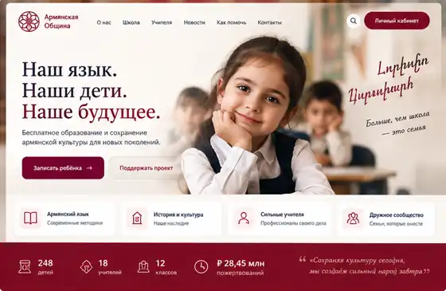

# Задание Codex: Армянская школа = община, вариант 2

Дата согласования: 20 сентября 2026 года.
Статус этой передачи: визуальное направление утверждено владельцем; этот коммит содержит только задание и референс, не реализацию приложения.

## 1. Что подтвердил владелец

«Второй вариант мне нравится, пусть будет такой сайт, а при авторизации мы будем видеть свой личный кабинет, кодексу передай пусть сделает как ты сделал».

Важное последующее уточнение: «Там как раз армянская школа — это и есть община».

**Доработать существующую «Армянскую школу». Школа и община — один проект/модуль. Не создавать вторую независимую общину, отдельную копию школы или новую изолированную ERP.** Публичный сайт и защищённые кабинеты — две части одной системы с согласованным визуальным стилем. Отдельный существующий раздел «Благотворительность» не переименовывать и не заменять этим проектом.

Дети бесплатно учат армянский язык. Пожертвования добровольные и не являются условием обучения, доступа к расписанию или зачисления.

## 2. Обязательный визуальный референс

Файл: `docs/design/armenian-school/reference-approved-variant-2.webp`.
Это кадр второго варианта из исходной композиции: светлый сайт с бордовыми акцентами, крупным заголовком слева и фотографическим сюжетом школьного занятия справа. Открой изображение перед проектированием и при финальном сравнении. Это не приглашение придумать другой дизайн.

Повторить композицию, настроение, пропорции и визуальную иерархию, а не просто перекрасить текущие таблицы. Не переносить весь скриншот в качестве интерфейса: сделать настоящую адаптивную вёрстку с доступными текстами, ссылками и формами.

Ориентиры для дизайн-токенов, с уточнением по референсу:
- молочный фон около `#FAF7F1`, белые поверхности;
- основной глубокий бордовый около `#8B1538`, мягкий светло-розовый для вторичных поверхностей;
- почти чёрный тёплый цвет текста около `#282326`, спокойные серые подписи;
- крупный выразительный шрифт с засечками для главного заголовка; легко читаемый шрифт без засечек для интерфейса;
- много свободного пространства, тонкие бордовые линейные иконки, мягкие тени, умеренные скругления;
- небольшие армянские культурные/орнаментальные детали, без перегруза и без неоновой или тёмной темы.

Числа «248», «18», «12», «28,45 млн», надписи от руки и прочие детали изображения — элементы демонстрационной концепции, НЕ подтверждённые сведения о школе. Не превращать их в рабочие данные. Фотография из сгенерированного референса не является фотографией реальных учеников этой школы. Для опубликованного сайта использовать согласованные материалы; иллюстрации не выдавать за реальные фотографии школы. Не выдумывать название юридического лица, адрес, реквизиты, отзывы или сведения о преподавателях.

## 3. Сначала найти существующую школу

Прочитать `AGENTS.md` и `docs/workflow/README.md`. Проверить актуальный `origin/main`, незавершённые изменения и подключённые рабочие папки, не перезаписывая чужую работу.

Найти существующий раздел/проект «Армянская школа»: маршруты, пункт меню, идентификатор проекта, хранилище, существующую авторизацию и данные. Название может быть записью в рабочей системе, а не именем файла. Поиск по названию в опубликованной ветке при подготовке задания не дал совпадений; это не доказательство отсутствия локальной школы. Не утверждать, что модуль уже найден, пока не проверены фактические файлы/маршруты.

Сохранить идентификаторы, существующие записи и связи. Если облачная копия не содержит школы, а локальная рабочая папка недоступна, сообщить точную границу доступа и запросить путь/ветку вместо создания дубликата. Не выгружать рабочую базу, персональные данные или локальные настройки в публичный репозиторий.

После обнаружения модуля выполнять реализацию, а не ограничиваться планом. По возможности расширять существующие компоненты, сервер и авторизацию, не переписывать всю ERP.

## 4. Публичная часть до входа

Начальный адрес школы показывает публичный сайт без административной боковой панели ERP. Существующий пункт «Армянская школа» должен вести в тот же проект. Конкретные маршруты выбрать после проверки действующей маршрутизации; не ломать старые адреса.

Первый экран:
- компактная шапка, существующее название/логотип школы, навигация «О нас», «Школа», «Учителя», «Отчётность», «Новости», «Контакты» и заметная кнопка «Личный кабинет»;
- слева заголовок в три строки: «Наш язык. / Наши дети. / Наше будущее.»;
- пояснение: «Бесплатное обучение армянскому языку. Сохраняем культуру и объединяем семьи.»;
- основная бордовая кнопка «Записать ребёнка» и вторичная «Поддержать школу»;
- справа большой тёплый школьный фотосюжет в композиции референса;
- ниже четыре спокойные карточки: армянский язык, история и культура, преподаватели, сообщество;
- бордовая горизонтальная полоса только с подтверждёнными агрегатами и указанным периодом. Если данных нет, показывать честное состояние без вымышленных счётчиков.

Продолжение страницы: программа бесплатного обучения, преподаватели, жизнь школы, понятный блок поддержки и публичная финансовая прозрачность. Тексты и настоящие контакты брать из проверенных материалов проекта. Пожертвования предлагать без давления, ложной срочности и обещаний, которые система не подтверждает.

Форма записи должна действительно сохранять заявку в серверной системе и показывать результат; не подменять запись alert-окном. Собирать только необходимые сведения, предпочтительно контакт родителя и возрастную группу, а не избыточные сведения о ребёнке в публичной форме.

## 5. Вход и личные кабинеты

Кнопка «Личный кабинет» открывает действующий вход. После успешной авторизации посетитель попадает в **свой кабинет школы/общины**, а не в общий коммерческий дашборд компании. Если сеанс уже действителен, переходить сразу в кабинет. Выход и истечение сеанса должны закрывать доступ и очищать защищённые данные из интерфейса.

Предлагаемые роли сопоставить с фактической моделью приложения; права должны быть ограничены школой и нужными объектами. Один человек может одновременно быть родителем, участником и жертвователем.

- Участник/жертвователь: свой профиль, собственные взносы и их статусы, история поддержки, доступные общие отчёты, события. Не показывать чужие платежи или персональные данные. Регулярную поддержку отображать только как реально существующую подписку либо явно обозначенное намерение, не имитировать автосписания.
- Родитель: только связанные с ним дети, группы, расписание и сообщения школы. Прогресс и посещаемость — если доступны в существующей модели или реализованы и проверены.
- Учитель: только назначенные группы, занятия и ученики; работа с расписанием/посещаемостью в пределах прав. Личные расчёты по оплате — только свои и только при предусмотренном доступе.
- Руководитель/уполномоченный администратор школы: ученики и группы, преподаватели, участники, заявки, поступления, расходы, бюджет, отчёты и настройки доступа. Администрирование школы не должно автоматически давать права администратора всей ERP.

Внутри кабинета сохранить молочно-бордовую палитру и типографику, но использовать удобную рабочую навигацию и компактные таблицы. Сделать ясное различие между «мой вклад» и «общая отчётность».

## 6. Общий дашборд и управленческий учёт

Одна согласованная модель данных для публичных агрегатов, личных кабинетов и управления. Не создавать несвязанные демонстрационные цифры для разных экранов.

Дашборд руководителя:
- поступления за выбранный период, фактические расходы, остаток средств, план бюджета и необходимое финансирование;
- динамика подтверждённых взносов по дням/месяцам, сравнение периодов при достаточном покрытии;
- распределение расходов, план/факт и расшифровка до разрешённых первичных записей;
- показатели обучения из реальных данных: дети, группы, преподаватели, проведённые занятия;
- фильтры периода и, при наличии структуры, филиала/подразделения; источник и дата актуальности.

Расходы учитывать по всей структуре **школы/общины**, не раскрывая финансовые данные остальных компаний ERP:
1. Оплата преподавателей: преподаватель, занятия/часы, ставка, начислено, выплачено, статус и период — в закрытом управленческом контуре.
2. Управленческие расходы: руководство, администрирование, бухгалтерское сопровождение и другие существующие функции.
3. Аренда, коммунальные услуги, учебные материалы, мероприятия и прочие утверждённые категории.

У записи расхода должны быть дата, категория, подразделение/проект при наличии, сумма и валюта, статус, ответственный, основание/документ и необходимые разрешения. Публично показывать утверждённые агрегаты по категориям; индивидуальные зарплаты, контакты, платёжные реквизиты и закрытые документы не публиковать.

Денежные правила:
- планы, обещания и ожидаемые переводы не равны полученным деньгам;
- поступления, возвраты, выплаты и внутренние переводы различать; не считать одну операцию дважды;
- существующая история «Благотворительности» может отражать исходящие перечисления: не считать их входящими пожертвованиями школы без явного проверенного сопоставления направления и получателя;
- остаток рассчитывать из подтверждённого начального остатка и денежных движений; начисленные, но не выплаченные зарплаты показывать отдельно от кассового расхода;
- суммы хранить точно, используя принятый в проекте десятичный формат/минимальные денежные единицы;
- разные валюты не складывать без явно заданного курса и даты пересчёта;
- отсутствие загруженной истории показывать как «Данные не загружены», а не как доказанное отсутствие пожертвований;
- при неполном покрытии пояснять границы расчёта, при ошибке запроса не заменять сохранённую историю фиктивным нулём.

## 7. Защита данных и настоящие действия

Авторизацию и права проверять на сервере для чтения, изменения, экспорта и доступа к документам; скрытая кнопка не является защитой. Публичный API возвращает только опубликованные агрегаты. Проверить, что участник A не может прочитать кабинет участника B подстановкой идентификатора, родитель — чужого ребёнка, учитель — чужую группу.

Использовать существующую безопасную работу с сеансами; не создавать вход на основе роли в localStorage. Учесть CSRF для изменяющих запросов, валидацию ввода, очистку пользовательского HTML, ограничение попыток входа и защиту файлов в рамках архитектуры проекта. Не нарушать права других модулей.

Публичные отчёты отделить от внутренней первички и публиковать только после разрешённого действия администратора. Не отдавать через публичные ссылки неотредактированные банковские выписки или документы с персональными данными. Фотографии и сведения о детях не публиковать автоматически.

Не подключать новый эквайринг, реальные списания или случайные банковские реквизиты в рамках этого задания. Кнопка поддержки использует только уже проверенный доступный способ оплаты. Если его нет, явно сообщать об этом и предоставлять работающую заявку на связь при наличии реального канала, без ложного сообщения «Оплата прошла».

Все реализованные действия сохранять на сервере, обрабатывать загрузку, ошибки, пустое состояние и конфликт изменений. Демоданные допускаются только в изолированном явно помеченном режиме и никогда не заменяют рабочую базу.

## 8. Критерии приёмки и отчёт

- Существующая школа найдена и доработана; в отчёте указаны реальные пути/маршруты и сохранённые связи, дубль общины не создан.
- Публичный экран узнаваемо повторяет именно приложенный второй вариант; кабинеты выполнены в той же системе оформления.
- До входа доступны только публичные страницы и разрешённая отчётность. После входа открывается собственный кабинет; права соответствуют роли и объектам.
- Приём заявок, просмотр собственной истории, разрешённое ведение расходов и дашборд работают на проверенных данных. Каждый недоступный источник/ещё не реализованная возможность названы прямо, а не замаскированы демонстрацией.
- Бесплатность обучения не зависит от пожертвований.
- Проверены финансовые статусы, возвраты, валюты, пустая/неполная история, запрет доступа к чужим объектам, выход и истечение сеанса.
- Адаптивность проверена на 390, 768 и 1440 CSS px; нет горизонтальной прокрутки страницы, обрезанных текстов и недоступных кнопок. Клавиатурный фокус виден, формы подписаны, контраст достаточный.
- Выполнены `node scripts/check.cjs` и профильные тесты на итоговой версии. Приложены снимки публичной страницы, кабинета участника и управленческого дашборда на изолированных данных.
- В итоговом отчёте: что реализовано, точные маршруты, результаты проверок, оставшиеся ограничения, ссылка на коммит/PR. Не заявлять готовую оплату, авторизацию, синхронизацию или развёртывание без проверки.

Работать в отдельной ветке/worktree и сохранять чужие изменения. Не использовать force push, reset --hard или очистку рабочей папки. Не сливать в `main`, не публиковать сайт, не перезапускать рабочий сервер и не менять реальные бизнес-данные автоматически. Сначала показать владельцу результат для приёмки.
