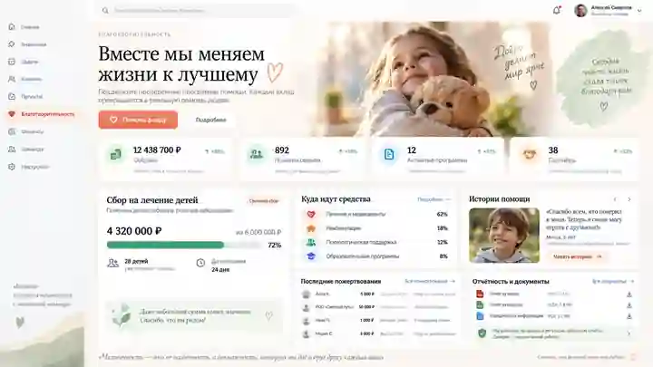

# Задание Codex: тёплый светлый редизайн «Благотворительности»

## Запрос владельца

Владелец одобрил приложенный визуальный макет и просит оформить существующий раздел «Благотворительность» именно в этом стиле: красиво, тепло, профессионально, чтобы возникало желание помогать фонду. Нужна реализация интерфейса, не очередное описание или статичная картинка вместо страницы.

Файл `reference-approved.webp` — уменьшенная копия одобренной AI-концепции. Это референс композиции и стиля, НЕ источник фактов о фонде. Все суммы, проценты, имена, фотографии, истории, диагнозы, сроки и результаты на изображении являются иллюстративными. Не переносить их в рабочие данные и не выдавать изображённых людей за реальных подопечных.

## Область задачи и порядок работы

1. Прочитать `AGENTS.md`, `docs/workflow/README.md` и применимые вложенные инструкции. Получить актуальную основу, сохранить чужую незавершённую работу. Работать изолированно в ветке этого PR либо отдельной ветке реализации с указанием связи с PR.
2. Изучить существующие `projects/marketplace-dashboard/dist/charity.html`, `charity.css`, `charity.js`, подключённые общие стили и навигацию; прочитать `charity-tools.cjs`, `charity-workspace.cjs` и относящиеся к модулю тесты. Проверить, являются ли dist-файлы исходниками или результатом сборки, и менять правильный источник.
3. Реализовать визуальный редизайн только благотворительного раздела. Не переписывать приложение, не менять стек, не добавлять тяжёлые зависимости. Не изменять финансовую логику, API-контракты, рабочие базы и права доступа. Не подключать оплату, внешнюю синхронизацию, аналитику или новые сервисы.
4. Не сливать PR автоматически, не публиковать сайт и не перезапускать рабочий сервер. По завершении предоставить проверяемый результат в GitHub.

## Визуальное направление

Максимально приблизить характер и композицию к референсу, а не ограничиться перекраской старой таблицы.

- Светлый молочный фон, белые карточки, мягкие тени, тонкие тёплые границы, много свободного пространства. Ориентиры палитры: фон #FAF7F2, карточки #FFFFFF, основной текст #202522, вторичный #606C65, коралловый акцент #E77860, шалфейный #DCE8D9, зелёный #438968. Подобрать контрастные варианты для текста и кнопок, а не использовать пастель для мелких надписей.
- Крупный выразительный заголовок с засечками и поддержкой кириллицы; интерфейсный текст — спокойный sans-serif. Использовать существующие локальные шрифты или системные fallback, без внешних трекеров. Заголовок первого экрана: «Вместе мы меняем жизни к лучшему». Подзаголовок без неподтверждённых обещаний, например: «Помощь начинается с участия. Узнайте о программах и поддержите доброе дело».
- Первый экран: слева заголовок, короткий текст, коралловая кнопка «Помочь фонду» и вторичная «Подробнее»; справа тёплый визуальный образ заботы. Использовать разрешённые локальные материалы фонда, если они есть. Иначе — качественная нейтральная декоративная иллюстрация, не вымышленный портрет подопечного. Не вставлять весь скриншот референса как фон или готовый интерфейс.
- Карточки со скруглениями примерно 20–24 px, интервалы 20–24 px, внутренние отступы 24–32 px, аккуратные согласованные иконки. Неброские hover/focus-переходы, без давления, мигающих баннеров и искусственной срочности.
- Сохранить настоящую навигацию и название текущего приложения. Не переносить выдуманные профиль пользователя, пункты меню и организацию из изображения. Светлые стили изолировать областью страницы, например `.charity-page`, чтобы не сломать общий тёмный интерфейс других разделов.

## Композиция и привязка к данным

После главного баннера разместить ряд компактных карточек, затем карточки программ/прозрачности и истории, ниже подробную историю и административные инструменты. Первый экран не должен выглядеть как бухгалтерская таблица, но действующие функции должны остаться доступными.

- Суммы и количество операций брать только из действующего `/api/charity`. Не называть исходящие операции «Собрано», если их смысл иной; использовать точную подпись вроде «Подтверждённые операции». Сохранить раздельные итоги по валютам и исходное понимание completed/executed/pending/cancelled/refunded. Не рассчитывать число семей, партнёров, рост или распределение расходов по догадке.
- Состояния отсутствия истории, неполного охвата, загрузки, ошибки и отсутствия результатов фильтра различать. Отсутствие данных не равно нулю пожертвований. Информацию об источнике, дате и полноте оставить заметной, но визуально спокойной.
- Дизайн карточек «Текущая программа», «Куда идут средства», «Истории помощи», «Отчётность и документы» строить по референсу. Отображать реальные содержательные данные только там, где они доступны в существующих разрешённых источниках. При отсутствии — аккуратное честное пустое состояние или скрытие неподдерживаемого блока; не выдумывать цели, проценты, отчёты, медицинские истории или ссылки. Не менять backend только ради заполнения красивых карточек.
- Подтверждённые операции показать компактным списком и сохранить доступ к полной таблице, фильтрам даты/магазина/статуса, обновлению, источникам и документам.
- Импорт JSON, предпросмотр, явное подтверждение импорта и сообщения об ошибках сохранить; административную часть оформить сворачиваемой секцией ниже. Сохранить ограничения владельца, не делать раздел или историю публичными.
- «Помочь фонду» может вести только на уже существующую разрешённую и проверенную страницу поддержки. Если такой ссылки нет, кнопка открывает доступную информационную панель с честным сообщением «Способ поддержки ещё не настроен». Не имитировать оплату, не показывать успешное пожертвование, не придумывать реквизиты и не делать кнопку без реакции. «Подробнее» открывает реальный раздел с имеющейся информацией.
- Личные данные доноров, документы и сведения подопечных не публиковать вне существующих прав доступа. Не утверждать независимую проверку фонда или аудит, если это не подтверждено.

## Адаптивность и проверка

Сделать полноценные состояния для телефона, планшета и desktop. Проверить ширины 390, 768 и 1440 px: нет обрезанных текстов, наложений и горизонтального скролла страницы; широкая таблица может иметь собственную прокрутку. Читаемый русский текст, удобные touch-targets, семантические заголовки, клавиатурная навигация, видимый focus, доступная модальная панель и `prefers-reduced-motion` обязательны.

Сохранить используемые JavaScript идентификаторы либо согласованно обновить обработчики и тесты. Не ослаблять экранирование пользовательского текста, проверку URL, ограничения импорта, авторизацию и защиту запросов.

Проверить рабочие кнопки, фильтры, предпросмотр/импорт на изолированных тестовых данных, ошибки, неполную и незагруженную историю, пустую выборку, несколько валют, все статусы. Тестовые данные не помещать в рабочее хранилище и не выдавать за данные фонда. Запустить `node scripts/check.cjs` и релевантные проверки; не скрывать недоступные проверки.

## Результат

Нужны код редизайна, скриншоты desktop и mobile, краткий отчёт по изменениям и тестам, список оставшихся потребностей в реальных материалах фонда, ссылка на опубликованный коммит/PR. До завершения сравнить скриншоты с референсом по композиции, цвету, типографике, плотности и ощущению тепла. Главный критерий: узнаваемый одобренный стиль плюс полностью сохранённый действующий учёт, без фиктивных данных и платежей.

## Статус первоначальной передачи

Этот документ и изображение составляют задание для реализации. В первоначальном коммите передачи нет изменений кода приложения. Полный checkout в среде передачи был недоступен из-за сетевого ограничения; `node scripts/check.cjs` здесь не запускался. Реализующий агент должен выполнить проверки на точной итоговой версии до публикации своего кода.
