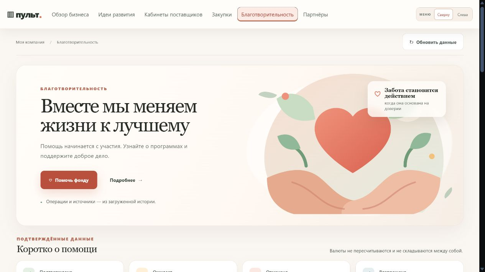
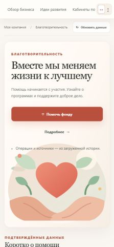

# Реализация редизайна

Существующий раздел благотворительности получил светлый молочный фон, коралловые акценты, выразительный заголовок с засечками и нейтральную локальную иллюстрацию заботы. Композиция следует одобренному референсу: главный баннер, компактные показатели, карточки прозрачности и истории, подробный учёт ниже. Изображения людей и вымышленные сведения из концепции не использованы.

Меняются только файлы интерфейса раздела. Прежние API, серверный учёт, авторизация и рабочее хранилище сохранены. Недавние операции включают completed/executed; полная таблица сохраняет все пять статусов и раздельные итоги валют. При временном сбое данные помечаются как ранее загруженные, при 401/403 защищённое содержимое очищается. Исправлено отображение источника и числа записей в предпросмотре импорта. Дата снимка корректно отображается и для календарной даты, и для ISO timestamp.

Кнопка помощи открывает доступный информационный диалог, пока проверенная ссылка поддержки не подключена. Диалог работает с клавиатурой, Escape закрывает его и возвращает фокус. Подробнее ведёт к сведениям; импорт свёрнут ниже истории и требует отдельного подтверждения.

## Проверки

- Профильные тесты благотворительности: 19 успешных проверок; новые regression-тесты проверяют ошибки обновления, потерю доступа, безопасный вывод текста и предпросмотр.
- Полный `node scripts/check.cjs` выполнен на итоговой версии перед публикацией.
- В браузере на изолированном хранилище проверены три валюты, пять статусов, фильтры магазина/даты/статуса, сброс, пустая выборка, незагруженная и неполная история, ошибка, запрет доступа и права импорта.
- Импорт проверен на синтетической записи: предпросмотр не пишет данные, изменение метаданных сбрасывает подтверждение, явное подтверждение добавляет одну запись.
- Проверены ширины 390, 768 и 1440 CSS px: горизонтальной прокрутки страницы нет; широкая таблица имеет собственную прокрутку. Проверены фокус и диалог; предусмотрен reduced motion.
- Снимки содержат только изолированные тестовые данные. Из-за масштабирования встроенного браузера desktop сохранён в его штатном viewport 1280 px, mobile — из изолированной рамки шириной 390 CSS px с уменьшенным размером захвата. Искажённые полноэкранные склейки не включены.
- Общее сохранение старой рабочей папки через `vagram prepare` отдельно выявило незавершённую сборку модуля распознавания договоров: в подготовленный снимок не вошёл Python extractor. Чужие финансовые изменения не включены в этот PR; проверка PR выполняется в изолированной ветке.

## Снимки

## Реальные материалы, которые ещё нужны

Для содержательных карточек нужны подтверждённые описания программ и целей, разрешённые материалы фондов, проверенная ссылка поддержки, опубликованные отчёты и согласованные истории помощи. Пока источник не передаёт эти сведения, показаны честные пустые состояния. Регулярные планы помощи не являются уже исполненными операциями и не прибавляются к фактическим суммам.

После отдельного прямого указания владельца три UI-файла применены к существующему локальному разделу Пульта. Работающая история проверена без изменения базы; временный отдельный сервер предпросмотра отключён. PR не сливался автоматически, остальные модули приложения не заменялись.
